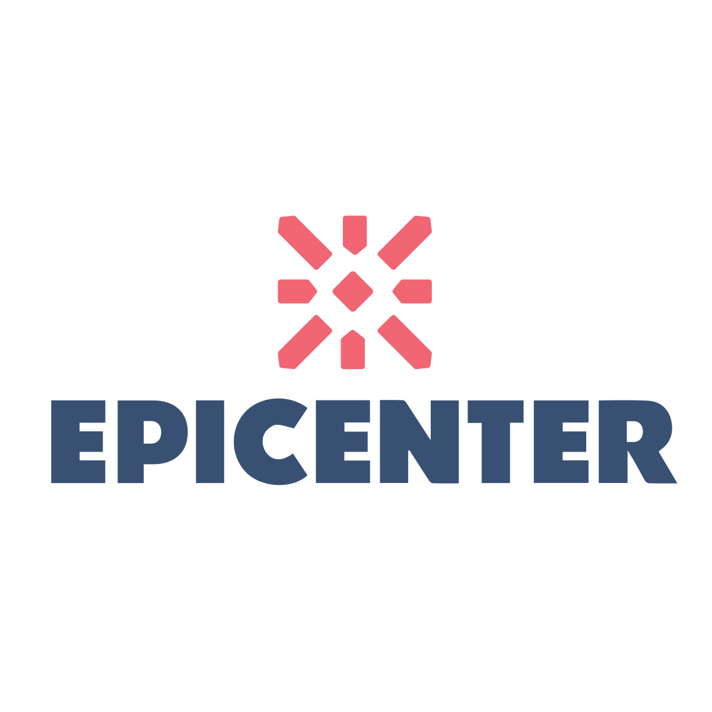
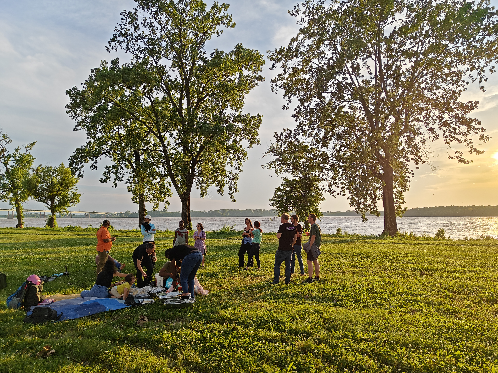
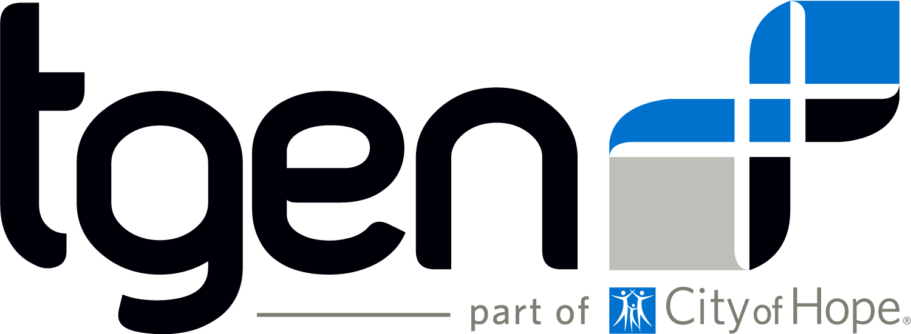
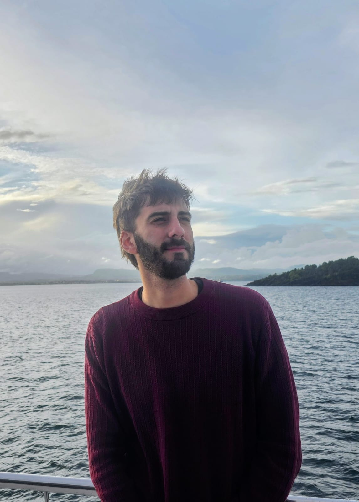

= *MemPanG26 - Memphis Pangenomics 2026*
:figure-caption!:
:toc-title: MemPanG26
:toc: left
:toclevels: 2

++++

++++

Computational pangenomics course, conference, and biohackathon in Memphis, TN, exploring the cutting edge of pangenomes, biology, methods, software, and artificial intelligence (AI).

== *Important Dates*

- Practical course/Conference/Biohackathon Registration Deadline: *April 10, 2026*
- Selected participants will be notified by: *April 17, 2026*
- Payment Deadline: *April 30, 2026*
- Practical course / Workshop: *May 11-12, 2026*
- Conference: *May 13, 2026*
- Biohackathon: *May 14-15, 2026*

== *OPEN CALL FOR SPEAKERS*
We invite experts and enthusiasts in pangenome research to present at the MemPanG26 conference on May 13, 2026. 
The submission deadline for talk proposals is *April 15, 2026*.

*Focus Areas:* The conference aims to delve into the multifaceted world of pangenome research and will cover a broad range of topics, including but not limited to, methods in pangenome research, genome assembly, data visualization, artificial intelligence (AI), and collaborative projects.

*Diverse Perspectives:* We are looking for speakers who can provide insights from different species contexts and who can discuss topics that lie at the intersection of pangenome methods and biology. We are particularly interested in hearing about your unique work and perspectives in pangenome research.

*Duration:* Invited talks are 15 minutes, followed by 5 minutes of discussion. Participant flash talks are 8 minutes, followed by 2 minutes for questions.

=== -> link:https://docs.google.com/forms/d/e/1FAIpQLScxnkkHBS5Fpzzsyx8WQ5Ej1NPJzU4BCOGGTd0X_bimHUtDTg/viewform?usp=publish-editor[*Conference pre-registration for speakers*] 

We look forward to an engaging day of discussion!

_MemPanG26 organizers_

== *Sponsors*

[cols="1,4", frame=none, grid=none]
|===
2+| 

2+| +++

+++

| 
| As the Innovation Hub of the Delta, Epicenter exists to ensure that founders of innovative businesses have what they need to develop, launch and grow their ventures in the Greater Memphis region.

|===

+++

MemPanG26 welcomes sponsorship from organizations that want to support open, collaborative pangenomics research and training.

If you are interested in sponsoring MemPanG26, please contact the organizers to discuss opportunities for the practical course, conference, and biohackathon.

+++

== *Venue*

=== Epicenter HQ  link:https://maps.app.goo.gl/5hj3XLNd8o5AwjX36[map]
150 Peabody Place,Memphis, TN 38103, United States +

+

=== Hotels in Memphis
- link:https://goo.gl/maps/arRZWkjPCNBAFfCf9[La Quinta Hotel Memphis Downtown]
- link:https://goo.gl/maps/Dwf9LgHeJLXsAJcf7[Double Tree Hotel]
- link:https://goo.gl/maps/h5A6LpmToTD7DepH8[River Inn at Harbor Town Hotel]
- link:https://goo.gl/maps/o7XrW3DZHTNqXXT26[Comfort Inn]
- link:https://goo.gl/maps/e365A6rNjZUPvFqRA[Hampton Inn]
- link:https://goo.gl/maps/rjdSg46kZFPsmKxS7[Hyatt Centric Beale Street]
- link:https://goo.gl/maps/e4BcvEabefsqEhC4A[HU Hotel]
- link:https://goo.gl/maps/Erq5cwVtM4hh8c8e7[Sheraton Memphis Downtown Hotel]

==== -> link:https://www.memphistravel.com/sports-outdoors?gclid=Cj0KCQiAgOefBhDgARIsAMhqXA4Gt_kloBAAqe5LDWNW3199TI8DzRrUo4fCqSQ_cKLkRPd4xv46TUgaAt4WEALw_wcB[Explore Memphis]

=== Transportation in Memphis

If you stay in Downtown, the Medical District, South City, or New Chicago, you can reach the event venue by getting on-demand, convenient, and affordable rides with link:https://city.ridewithvia.com/groove-on-demand[Groove On-Demand].

== *About the practical course / workshop*

*Monday, May 11, 2026 - Tuesday, May 12, 2026* +
The use of a single reference genome in bioinformatics can lead to reference bias and miss important information about genome variability and relationships. New assembly methods have made it easier to generate high-quality complete genome assemblies, and using a pangenome graph that expresses many genomes and their mutual alignment can help address these issues.
This practical course / workshop will focus on building such graphs from whole genome assemblies and using them in various downstream applications in comparative genomics, evolution, variation analysis, sequence alignment, and phenotype association.

Participants will learn about pangenome concepts and gain practical experience building and analyzing pangenome graphs. They will apply these methods to complex research questions that require understanding the relationships between multiple genomes or accounting for variability when analyzing new genomes.
By the end of the practical course / workshop, participants will have a strong understanding of pangenome methods based on whole genome assemblies.

== *About the conference (free attendance)*

*Wednesday, May 13, 2026* +
The in-person conference on the day after the practical course / workshop will bring together practical course / workshop participants and virtual and in-person speakers who are actively working on diverse aspects of pangenome research. Speakers will cover topics at the intersection of pangenome methods and biology, including a focus on basic methods, data structures, genome assembly, data visualization, and public collaborative pangenome projects.
We expect to draw speakers from a diverse set of species contexts.

*Virtual and in-person attendance is free and open to the public. Link for attendance will be posted soon*

== *About the biohackathon*

*Thursday, May 14, 2026 - Friday, May 15, 2026* +

The biohackathon focuses on software development.
We will work with/on pangenomic tools (such as link:https://github.com/pangenome/pggb/[PGGB], link:https://github.com/waveygang/wfmash/[WFMASH], link:https://github.com/pangenome/impg/[IMPG], link:https://github.com/ekg/seqwish/[SEQWISH], link:https://github.com/pangenome/odgi/[ODGI], link:https://github.com/pangenome/smoothxg/[SMOOTHXG], link:https://github.com/vgteam/vg[VG], link:https://github.com/vcflib/vcflib/[VCFLIB], link:https://github.com/genetics-statistics/GEMMA/[GEMMA]) with software project leadership.
*You are welcome to bring your own projects!*

== *People*

=== *Instructors*

==== *Erik Garrison* - Associate Professor

.[purple]#University of Tennessee Health Science Center, Memphis, TN, US#

image:images/erik.jpeg[erik,200,role="left instructor-photo"] Genomicist with a quantitative social science background. I build methods that let us understand the precise relationships between thousands of genomes. In these, the genome is encoded in a graph that may represent a population sample of individuals from the same species, a metagenome, the diploid genome of a single individual, or any other useful collection of sequences.

image:images/UTHSC.png[uthsc,160] {nbsp}{nbsp} image:images/Octicons-mark-github.svg[git,30] {nbsp}{nbsp}https://github.com/ekg[GitHub]

==== *Andrea Guarracino* - Assistant Professor

.[purple]#Translational Genomics Research Institute, Phoenix, AZ, US#

image:images/andrea.jpeg[andrea,200,role="left instructor-photo"] Computer scientist who applies pangenomics to the study of genome variation and disease.

 {nbsp}{nbsp} image:https://guarracinolab.github.io/images/GUARRACINOxLAB.png[lab,150,link="https://guarracinolab.github.io/"] {nbsp}{nbsp}https://guarracinolab.github.io/[Lab Website] +
 
+ 
+ 
+ 

==== *Franco Marsico* - Postdoctoral Fellow

.[purple]#University of Tennessee Health Science Center, Memphis, TN, US#

 Biologist focused on population genetics. Developing statistical methods for kinship inference and population structure.

image:images/UTHSC.png[uthsc,160] {nbsp}{nbsp} image:images/Octicons-mark-github.svg[git,30] {nbsp}{nbsp}https://github.com/MarsicoFL[GitHub]

'''

=== *Helpers*

==== Farnaz Salehi

.[purple]# PhD Student, University of Tennessee Health Science Center, Department of Genetics, Genomics and Informatics#
//image:images/niklas.jpeg[niklas,200,role="right"]

//+
//+
//+

//image:images/Octicons-mark-github.svg[git,30] https://scholar.google.com/citations?user=m_vTR7YAAAAJ&hl=en[Google Scholar]

==== Shuo Cao

.[purple]#University of Tennessee Health Science Center, Department of Genetics, Genomics and Informatics#
//image:images/arun.jpg[arun,200,role="right"]

//+
//+
//+

//image:images/Octicons-mark-github.svg[git,30] https://aruni.systemreboot.net[Website]

==== Ernestine Amos-Abanyie

.[purple]#University of Tennessee Health Science Center, Department of Genetics, Genomics and Informatics#
//image:images/arun.jpg[arun,200,role="right"]

//+
//+
//+

//image:images/Octicons-mark-github.svg[git,30] https://aruni.systemreboot.net[Website]

==== Fred Muriithi

.[purple]#University of Tennessee Health Science Center, Department of Genetics, Genomics and Informatics#
//image:images/arun.jpg[arun,200,role="right"]

//+
//+
//+

//image:images/Octicons-mark-github.svg[git,30] https://aruni.systemreboot.net[Website]

==== Enza Colonna

.[purple]#University of Tennessee Health Science Center, Department of Genetics, Genomics and Informatics#
//image:images/arun.jpg[arun,200,role="right"]

//+
//+
//+

//image:images/Octicons-mark-github.svg[git,30] https://aruni.systemreboot.net[Website]

'''

=== *Organizers*

==== link:https://andreaguarracino.github.io/[Andrea Guarracino], Translational Genomics Research Institute, Phoenix, AZ, US
==== link:http://hypervolu.me/~erik/erik_garrison.html[Erik Garrison], Department of Genetics, Genomics and Informatics, UTHSC, Memphis, TN, US
==== link:https://github.com/Flavia95[Flavia Villani], Translational Genomics Research Institute, Phoenix, AZ, US
==== link:https://thebird.nl/[Pjotr Prins], Department of Genetics, Genomics and Informatics, UTHSC, Memphis, TN, US
==== link:https://colonnalab.github.io/laboratory_WebPage[Enza Colonna], Department of Genetics, Genomics and Informatics, UTHSC, Memphis, TN, US
==== link:https://uthsc.edu/search/detail.php?id=T100344325[Tamara Brock], Department of Genetics, Genomics and Informatics, UTHSC, Memphis, TN, US

image:images/UTHSC.png[uthsc,300]

== *Program*

=== *Practical course / Workshop* Monday-Tuesday, May 11-12, 2026

[options="header", cols="2,1,2,4"]
|===
|Day | Time | Instructor(s) | Topic

|Monday, May 11, 2026 | 09:30-10:00  | Erik Garrison | Presentation: Introduction to pangenomics, pangenomes and pangenome graph representations
|| 10:00-10:45 | Everyone | Practical: Build your first pangenome graphs
|| *10:45-11:00* | *Everyone* | *Coffee break*
|| 11:00-12:30 | Everyone | Practical: Pangenome graph building with PGGB 
|| *12:30-14:00* | *Everyone* | *Lunch (provided)*
|| 14:00-14:15 | Andrea Guarracino | Presentation: Understanding and manipulating pangenomes
|| 14:15-15:45 | Everyone | Practical: ODGI toolkit commands
|| *15:45-16:00* | *Everyone* | *Coffee break*
|| 16:00-17:00 | Everyone | Practical: Sequence partitioning
|| 17:00-17:05 | Everyone | Q&A, Day 1 Survey
|===

[options="header", cols="2,1,2,4"]
|===
|Day | Time | Instructor(s) | Topic
|Tuesday, May 12, 2026 | 09:30-10:15 | Andrea Guarracino | Presentation: Implicit pangenomics
|| 10:15-10:45 | Everyone | Practical: Implicit pangenome graphs
|| *10:45-11:00* | *Everyone* | *Coffee break*
|| 11:00-12:30 | Everyone |  Practical: Implicit pangenome graphs
|| *12:30-14:00* | *Everyone* | *Lunch (provided)*
|| 14:00-15:30 |  Everyone |  Practical: Pangenome alignment compression
|| 15:30-15:45 | Franco Marsico | Presentation: Local ancestry inference from pangenomes 
|| *15:45-16:00* | *Everyone* | *Coffee break*
|| 16:00-17:00 | Everyone | Practical: Local ancestry inference 
|| 17:00-17:05 | Everyone | Q&A, Day 2 Survey
|| 17:05-17:15 | TBD | Closure
|===

=== *Conference* Wednesday, May 13, 2026

Invited talks are 15 minutes followed by 5 minutes of discussion. Flash talks from course participants are 10 minutes.

*Chairpersons:* Rob Williams, Enza Colonna

[options="header", cols="2,2,5,3,4"]
|===
|Session | Time | Title | Presenter | Affiliation

|*Registration*
|*09:00 - 09:30*
|*Registration and coffee*
|*
|*

|Opening
|09:30 - 09:45
|Introductory remarks
|Rob Williams
|Department of Genetics, Genomics and Informatics, UTHSC

|Full talk
|10:00 - 10:20
|Ultima Genomics - Redefining High-Throughput Sequencing
|Drew Greer
|Ultima Genomics

|Full talk
|10:20 - 10:40
|Towards interactive pan-genome browsing in JBrowse 2
|Diesh
|University of California, Berkeley

|Full talk
|10:40 - 11:00
|Developing a graphical pangenomic pipeline for detecting polymorphic mobile genetic elements
|Olivier Levine
|University of Georgia

|*Break*
|*11:00 - 11:20*
|*Coffee break*
|*
|*

|Full talk
|11:20 - 11:40
|GWAS Follow-up of Complex Polymorphic Loci with Pangenome Visualization
|Scott Mastromatteo
|The Hospital for Sick Children

|Full talk
|11:40 - 12:00
|When Pangenome Meets Behavior: Rat Genetic Diversity, Oxycodone Self-Administration, and the Search for Addiction Biomarkers
|Hao Chen
|Department of Pharmacology, Addiction Science and Toxicology, UTHSC

|Flash talk
|12:00 - 12:10
|A fast, lossless pangenome-aware read mapper
|Harieasswar Lakshmidevi
|Department of Genetics, Genomics and Informatics, UTHSC

|Flash talk
|12:10 - 12:20
|Plant immune system diversity with short reads - a la pangenome graph
|Gautam Shirsekar
|University of Tennessee

|Flash talk
|12:20 - 12:30
|Genome Graph Approaches for Tandem Repeat Haplotype Inference and Methylation Analysis
|Luis Fernandez Luna
|McGill University

|*Break*
|*12:30 - 14:00*
|*Lunch (provided)*
|*
|*

|Flash talk
|14:00 - 14:10
|Adapting PGGB to Recapture the Toxoplasma gondii mitochondrial DNA structure
|Rafeed Rahman Turjya
|University of Georgia

|Flash talk
|14:10 - 14:20
|LD and SegDup
|Laura Pignata
|Department of Genetics, Genomics and Informatics, UTHSC

|Flash talk
|14:20 - 14:30
|Pangenome-Wide Association Study (in mice)
|Andrea Guarracino
|TGen

|Full talk
|14:30 - 14:50
|Future directions in pangenomics
|Erik Garrison
|Department of Genetics, Genomics and Informatics, UTHSC

|Closing
|14:50 - 15:00
|Closing remarks
|Organizers
|
|===

=== *Biohackathon* Thursday-Friday, May 14-15, 2026 

[options="header", cols="2,1,4"]
|===
|Day | Time |  Topic
|Thursday, May 14, 2026 | 09:30-10:30 |  Kickoff - Project pitches
|| 10:30-12:00 |  Hacking
|| *12:30-14:00* |  *Lunch*
|| 14:00-15:30 | Hacking
|| 15:30-16:00 | Coffee break
|| 16:00-17:00 | Hacking  - Projects update
|===

[options="header", cols="2,1,4"]
|===
|Day | Time |  Topic
|Friday, May 15, 2026 | 09:30-10:30 | Hacking
|| 10:30-11:00 | Coffee break
|| 11:00-12:30 |  Hacking
|| *12:30-14:00* |  *Lunch*
|| 14:00-15:30 | Hacking
|| 15:30-16:00 | Coffee break
|| 16:00-17:00 | Projects Presentation - Conclusions 
|===

== *Registration and Practical Information*

=== -> link:https://docs.google.com/forms/d/e/1FAIpQLScxnkkHBS5Fpzzsyx8WQ5Ej1NPJzU4BCOGGTd0X_bimHUtDTg/viewform?usp=publish-editor[*Conference pre-registration for speakers*] 

=== -> link:https://docs.google.com/forms/d/e/1FAIpQLSdkpU3vpH_Mh8H43E5qbBOndkPYEhcK7bFWvC1inNjwefpgmQ/viewform?usp=publish-editor[*Registration for event attendees*]

Registration includes access to: all lectures and practical sessions, all course materials.

=== *Cost*

The cost includes all expenses associated with the event, with lunches, coffee, and snacks. 
In certain circumstances, we can waive the fees.

==== *Academic* - $250, with financial support if needed
==== *Industry* - $500

=== *Selection criteria*

This practical course / workshop is intended for biologists and bioinformaticians interested in studying organisms with high genetic diversity or without a reference genome, as well as those involved in comparative genomics and the assembly of pangenomes for any species.

Selection of participants will be based on:

- good knowledge of Linux operating system and basic shell commands. This will be a mandatory prerequisite.
- familiarity with genomics data formats (e.g., FASTA, VCF, BED, ...) is a plus.
- impact of the practical course / workshop for the participant and their research group.
- stage of the research project: priority will be given to participants with data already available and ready to be analyzed (participants data will not be analyzed during the practical course / workshop).

Fulfillment of these conditions by participants will be assessed through the registration form.

== *MemPanG Gallery*
Pictures from previous MemPanG editions: link:gallery.html[View the photo gallery]

[cols="1a,1a,1a", frame=none, grid=none]
|===
| image::images/mempang-gallery/hack.jpg[]
| image::images/mempang-gallery/people.jpg[]
| image::images/mempang-gallery/topview.jpg[]
|===

{empty} +
{empty} +

== *Contact*

- mailto:aguarracino@tgen.org[aguarracino@tgen.org]

image::images/DRB1-3123.fa.gz.pggb-E-s5000-l15000-p80-n10-a0-K16-k8-w50000-j5000-e5000-I0-R0-N.smooth.chop.og.lay.draw_mqc.CROP.png[800]
